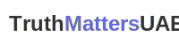

# TruthMattersUAE - Misinformation Awareness

A non-profit initiative dedicated to raising awareness and combating misinformation among college students in the UAE through education and research-based approaches.

## Project Overview

TruthMattersUAE is a comprehensive Next.js application designed to educate college-aged students in the UAE about the dangers of misinformation. The project presents research findings, educational resources, and practical solutions to help students identify and combat misinformation in their academic and personal lives.

### Key Features

- **Research Insights**: Data-driven analysis of misinformation prevalence among UAE students
- **Educational Resources**: Curated materials for students, educators, and institutions
- **Interactive Solutions**: Practical approaches to combat misinformation
- **Responsive Design**: Fully optimized for all device sizes

## Tech Stack

- **Framework**: Next.js 14 (App Router)
- **UI Library**: React 18
- **Styling**: Tailwind CSS
- **Components**: shadcn/ui
- **Animations**: Framer Motion
- **Charts**: Recharts
- **Icons**: Lucide React
- **Theming**: next-themes

## Project Structure

